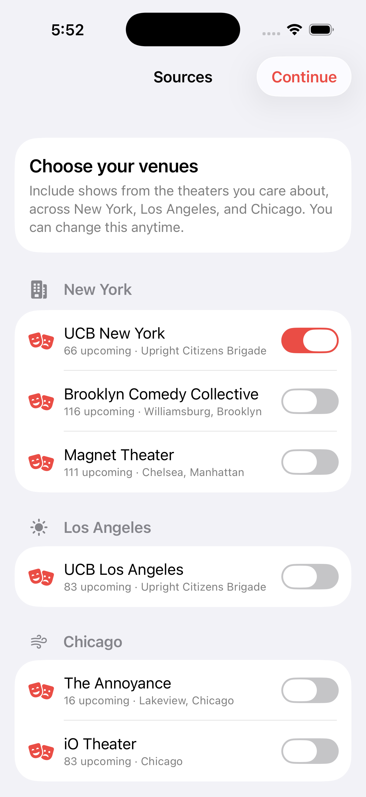
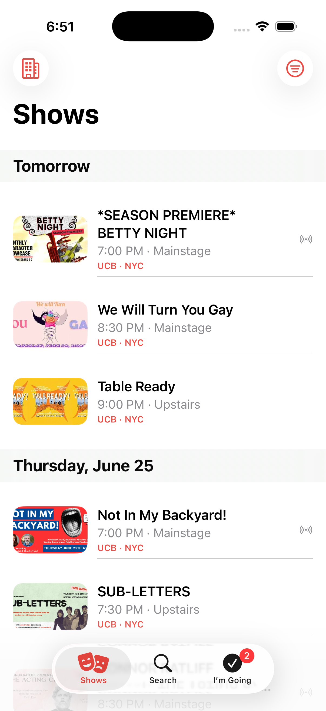
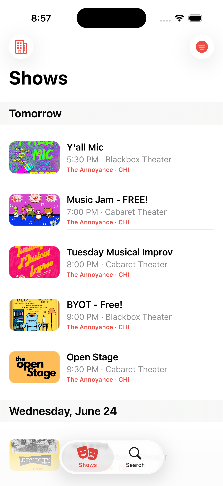

# Improv — iOS app

A native **SwiftUI** app for browsing upcoming improv/comedy shows across multiple
venues. It reads the same hourly-refreshed multi-source feed as the web backend
(`https://ucb-ny-shows-…run.app/shows.json`) and presents it with a first-party,
Apple-clean aesthetic.

<p>
  
</p>

**Sources** (choose any in Setup): UCB New York, Brooklyn Comedy Collective, Magnet
Theater (NYC); UCB Los Angeles (LA); The Annoyance, iO Theater (Chicago).

Verified building and running on the iOS 26.5 Simulator (iPhone 16 Pro) with the
live feed — **0 errors, 0 warnings**:

<p>
  
  
  
</p>

## Run it

Requires **Xcode 16+** (built/tested against Xcode 26.5, iOS 17+ deployment target).

```bash
open ios/UCBShows.xcodeproj
```

Pick an iPhone simulator (or your device) and press **Run** (⌘R).

> If a command-line build complains *"You have not agreed to the Xcode license"*,
> run `sudo xcodebuild -license accept` once. Building from the Xcode app doesn't
> need this.

No third-party dependencies, no package resolution — it builds as-is.

## What it does

- **Setup / Sources** — choose which venues to include, grouped by city
  (shown on first launch and reachable anytime via the toolbar). Unavailable
  sources are greyed out; live "N upcoming" counts per source.
- **Shows tab** — one unified list of all upcoming shows grouped into pinned date
  sections (Today / Tomorrow / weekday), each tagged with a source·city badge.
- **Pull to refresh** (both tabs) — re-reads the backend store for the latest data.
  It never triggers a scrape; scraping happens only on the backend's hourly
  schedule, and the refresh just surfaces whatever the last scheduled run stored.
- **Search tab** — live title/blurb search across all enabled sources.
- **I'm Going** — open a show and tap **I'm Going** on its page (next to Get
  Tickets) to add it to your list. The **I'm Going tab** gathers your planned shows
  (across all sources, regardless of Setup filters), grouped by date, with a count
  badge. Persisted across launches.
- **Filters** — city, venue, comedy type (multi-select), livestream, free, and a
  date window; **filters persist across launches** and apply to both tabs. A
  filter is auto-cleared if its city/venue stops being available (e.g. after
  disabling that city's sources).
- **Detail** — stretchy poster header, metadata chips, blurb, and a pinned
  **Get Tickets** button that opens the ticket page in an in-app Safari sheet.
- **Offline** — the last successful payload is cached to disk, so the app opens
  instantly and shows saved data (with a banner) when the network is unavailable.

## Design

Materials-first, content-led, stock components only — large titles, SF Symbols,
system materials, a single coral accent, full Dynamic Type, and light/dark for
free via semantic colors. Missing posters render a deterministic typographic
`GeneratedCover` rather than a broken image. The card→detail zoom transition uses
`.navigationTransition(.zoom)` on iOS 18 with a graceful fallback on iOS 17.

## Architecture

```
UCBShows/
  UCBShowsApp.swift          @main; injects ShowsStore, sets the tint
  Models/
    Show.swift               Decodable model (defensive) + derived display values
    Filters.swift            value-type filter state
  Services/
    ShowsService.swift       fetch + on-disk last-good cache
    ShowsStore.swift         @MainActor @Observable single source of truth
  Support/DateUtils.swift    NY-timezone parsing/formatting + day grouping
  DesignSystem/Theme.swift   accent, radii, per-type tints & symbols
  Views/                     RootView, ShowsFeedView, SearchView, ShowDetailView
  Views/Components/          ShowRow, HeroTonightCard, PosterImage/GeneratedCover,
                             FilterSheet, Chips, SectionsList, SafariView, …
  Assets.xcassets/           AccentColor (light/dark), AppIcon
```

Data flows one way: `ShowsService` fetches/decodes → `ShowsStore` holds, filters,
and date-groups → SwiftUI views render. The store is `@MainActor @Observable`;
networking/decoding happen off the main actor.

The project uses Xcode's modern *file-system synchronized* group, so new files
added under `UCBShows/` are picked up automatically — no `.pbxproj` edits needed.
A `project.yml` is included if you'd rather regenerate the project with XcodeGen.

## Data source

`ShowsService.feedURL` points at the live Cloud Run endpoint. To point it at a
different backend (e.g. a local `python app.py`), change that one constant.
